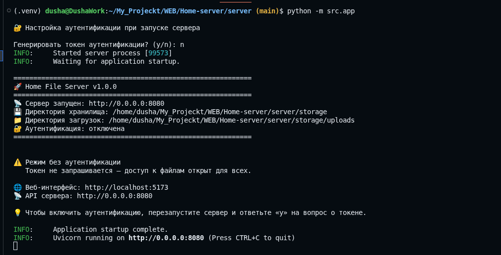
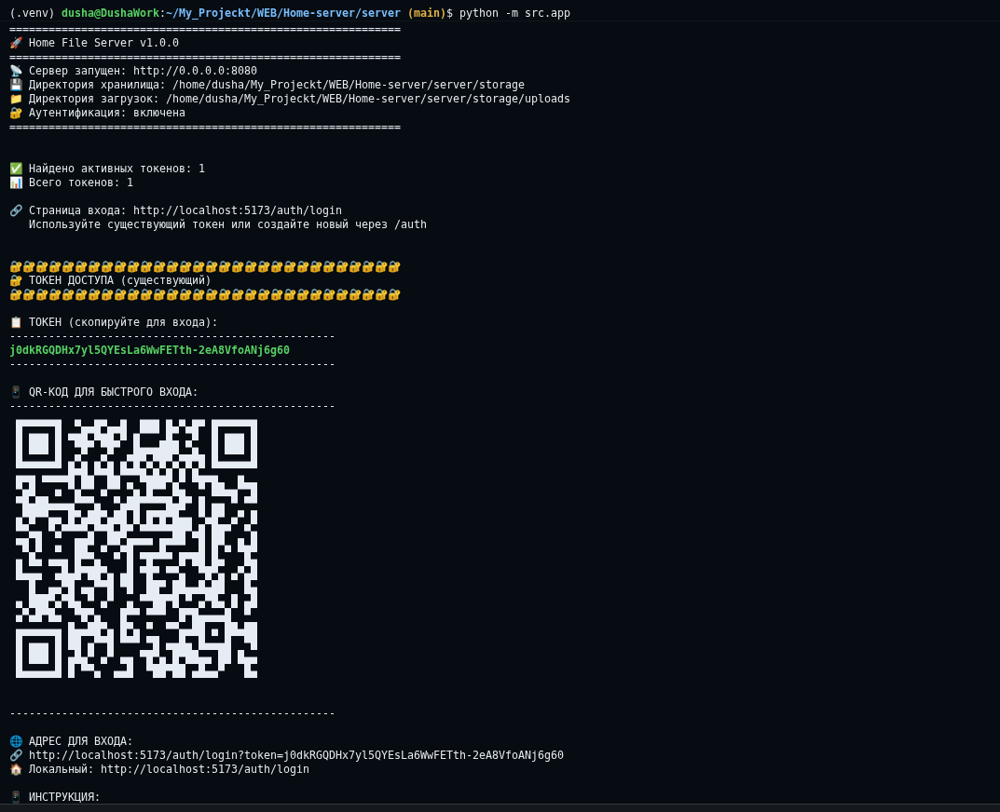
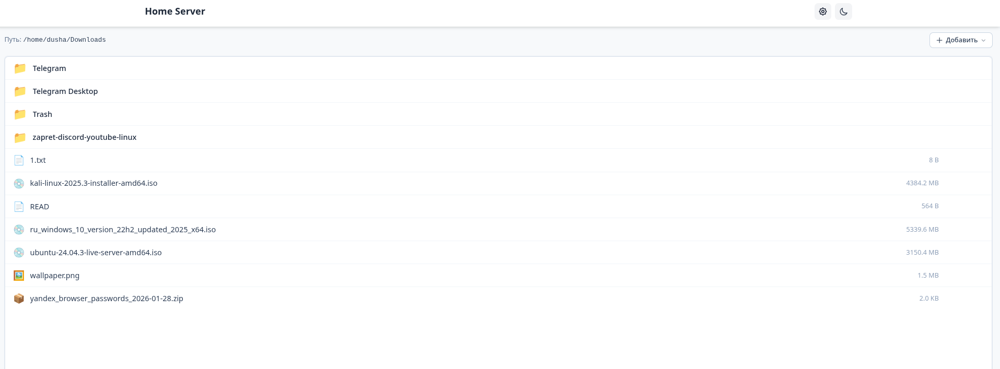

# Home File Server

A local HTTP server for file sharing on your home network. Browse, upload, and download files through a web interface with token-based authentication and quick QR code sign-in.

## About the project

**Home File Server** is a lightweight application for secure file sharing on a local network (LAN). Ideal for transferring files between computers and mobile devices without cloud services.

> ATTENTION!\
> The assembly of the banner is only for the server side. The UI interface should be assembled manually!

### Features

- **Web interface** — browse directories, preview images and text files, upload and download
- **Token authentication** — access only with a secret token; multiple tokens can be created
- **QR sign-in** — on startup the server displays a QR code; scan it with your phone camera for quick login
- **Shared folders** — configurable list of shared directories with enable/disable support
- **API** — REST API for integration (token generation, file operations)
- **Run modes** — built-in web UI (single port) or separate API + frontend (development mode)

### Tech stack

- **Backend:** FastAPI (Python 3.10+)
- **Frontend:** SvelteKit, Svelte 5
- **Storage:** JSON files (tokens, directory list), file system

---

## Requirements

Install on your system:

- **Python** 3.10+
- **Node.js** 18+ and **npm**

Python dependencies are installed into the virtual environment **`server/.venv`** (created and used by `./start.sh`, or create it yourself and install packages).

---

## Quick start

After cloning the repository:

```bash
./start.sh
```

or via Makefile:

```bash
make run
```

The `start.sh` script checks for Node.js, npm, and Python (it does **not** install them via the system package manager). If something is missing, it prints manual installation hints. When everything is present, it creates **`server/.venv`** if needed, installs `server/requirements.txt`, builds the frontend, and starts the server.

**Web interface:** `http://localhost:8080` (or `http://<IP>:8080` from another device on the network).

On first run without a configured `.env`, the server will ask in the console: **with token (y)** or **without (n)**. For fully non-interactive run, create `server/.env` and set `AUTH_REQUIRED=true` or `AUTH_REQUIRED=false`.

### Manual setup (without start.sh)

```bash
python3 -m venv server/.venv
. server/.venv/bin/activate
pip install -r server/requirements.txt
cd frontend && npm ci && npm run build
cd ..
rm -rf server/static && cp -r frontend/build server/static
cd server && STATIC_DIR="$(pwd)/static" python -m src
```

Or set `STATIC_DIR` in `server/.env` and run `python -m src` from the `server` directory.

---

## Project structure

```
Home-server/
├── server/              # Backend (FastAPI)
│   ├── src/
│   │   ├── app.py       # Entry point
│   │   ├── core/        # Config, startup
│   │   ├── modules/
│   │   │   ├── auth/    # Authentication, tokens, QR
│   │   │   └── share/   # Files, directories, uploads
│   │   └── i18n.py      # Localization (ru/en)
│   ├── tests/           # Tests (pytest)
│   ├── storage/         # tokens.json, shared_directories.json
│   ├── requirements.txt
│   ├── requirements-dev.txt  # pytest, pyinstaller (CI / dev)
│   └── .venv/           # Python venv (not in git)
├── frontend/            # SvelteKit SPA
│   ├── src/
│   │   ├── routes/      # /auth/login, /workspace
│   │   └── lib/         # Components, API
│   └── package.json
├── docs/                # Deploy documentation
├── scripts/             # Helpers (frontend build, run-cli)
├── start.sh             # Run script (venv, npm, build, server)
└── Makefile
```

---

## Makefile

| Command | Description |
|---------|-------------|
| `make run` | If `server/.venv` and `server/static` exist — server only; otherwise full cycle (`./start.sh`). |
| `make run-full` | Full cycle like `./start.sh`. |
| `make run-server` | Server only (venv and static must already exist). |
| `make build` | Build frontend and copy to `server/static`. |
| `make dev` | Development mode (server with reload). |
| `make clean` | Remove `server/.venv`, `frontend/node_modules`, `server/static`. |

---

## Dev: separate API and Vite

After dependencies are installed in `server/.venv` and `frontend/node_modules`:

```bash
./scripts/run-cli.sh
```

---

## CI

On push to **`main`**, GitHub Actions runs Python tests (`pytest` under `server/`) and builds the PyInstaller binary (`server/home-file-server.spec`). The binary is uploaded as a workflow artifact.

### Release on tag

Pushing a tag matching **`v*`** (e.g. `v1.0.0`) runs the **Release** workflow: same tests, frontend build, **`home-file-server-static.zip`** (contents of `server/static`), binary **`home-file-server`**, and a **[GitHub Release](https://docs.github.com/en/repositories/releasing-projects-on-github/about-releases)** for that tag.

**Example:**

```bash
git checkout main
git pull
git tag -a v1.0.0 -m "Release v1.0.0"
git push origin v1.0.0
```

The binary does not embed the SPA; unpack the zip next to the binary and set **`STATIC_DIR`** to that static directory (see `server/.env.example`).

---

## Windows

Use PowerShell from the repo root:

```powershell
.\start.ps1
```

The script checks for **Python 3.10+** and **Node.js 18+**. If something is missing, it will prompt to install via **winget** (optional). Virtual environment path: **`server\.venv`**.

- Full clean reinstall: `.\start.ps1 --clean`

---

## QR sign-in and camera

The login page can scan a QR code with the device camera. **Browsers allow camera access only in a secure context:**

- over **HTTPS** (e.g. `https://your-server:8080`), or
- from **http://localhost** / **http://127.0.0.1** (when opening from the same machine where the server runs).

When opening **http://IP** (e.g. `http://192.168.1.5:8080`) from a phone or another PC, the browser will not allow camera access — this is a browser security restriction. In that case, enter the token manually on the login page.

**Note:** when running with `STATIC_DIR` (built-in web UI), console links automatically use `localhost:<port>` or `<IP>:<port>` of the server. In development mode (separate frontend), `FRONTEND_URL` is used (default `http://localhost:5173`).

---

## Environment variables

Full list: **[server/.env.example](server/.env.example)**.

| Variable | Description |
|----------|-------------|
| `AUTH_REQUIRED` | `true` — token required; `false` — no auth. If unset — console prompt on startup. |
| `STATIC_DIR` | Path to frontend build (e.g. `./frontend/build`). Set automatically by `start.sh`. When set, console links and QR point to the server (`server_host:server_port`). |
| `FRONTEND_URL` | Web UI URL when frontend runs separately (dev). Default `http://localhost:5173`. Ignored when `STATIC_DIR` is set. |
| `SERVER_HOST` | Server host (default `0.0.0.0`). |
| `SERVER_PORT` | Port (default `8080`). |
| `LANGUAGE` | Console language: `ru` or `en`. |
| `DEBUG` | `true` — reload on code change, verbose logs. |
| `SECRET_KEY` | Secret key (change in production). |
| `MAX_FILE_SIZE` | Max upload size (e.g. `100MB`). |

Create env file:

```bash
cp server/.env.example server/.env
# edit server/.env as needed
```

---

## Build for release

1. **Frontend only** (for development with a separate server):

   ```bash
   cd frontend && npm ci && npm run build
   ```

   Output: `frontend/build/`.

2. **Full run (frontend + backend in one process):**

   ```bash
   ./start.sh
   ```

   Or manually: build frontend (step 1), then set `STATIC_DIR` (absolute path to `frontend/build` or `server/static`) and `AUTH_REQUIRED` in `server/.env`, and run `python -m src` from `server` with `server/.venv` activated.

3. **Binary (PyInstaller)** — with `server/.venv` active and dev dependencies:

   ```bash
   . server/.venv/bin/activate
   pip install -r server/requirements-dev.txt
   cd server && pyinstaller home-file-server.spec
   ```

   Output: `server/dist/home-file-server` (Linux).

---

## Usage examples

### Server start without token


### Server start with token


### Web interface of shared folder workspace


---

## Documentation

- [docs/DEPLOY.en.md](docs/DEPLOY.en.md) — build and run for release
- [README.md](README.md) — Russian documentation

---

## License

See [LICENSE](LICENSE).
